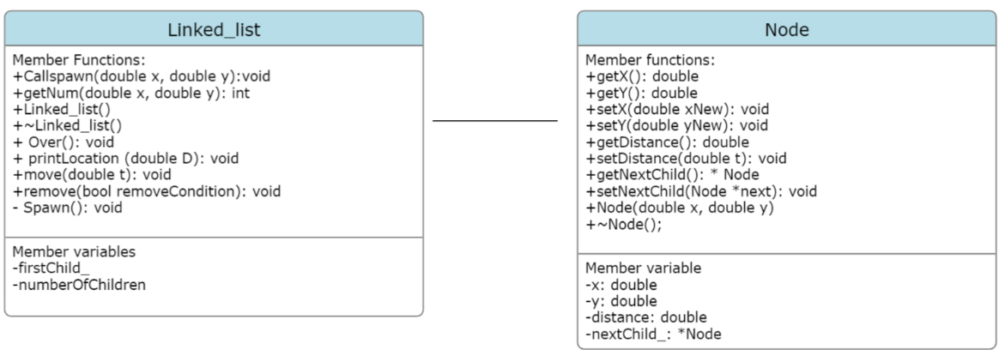

Rain Luo (r8luo)
September 25, 2023

Overview of Classes

Class linked_list: 

Design decisions: I decided to have a callSpawn and spawn function such that when the spawn function is called, no input validation needs to be made. This allowed both functions to be better organized. All functions declared are void, functions have the ability to directly output to the console. This is to avoid having multiple return statements, which may cause unexpected exits. As well, I do not want to have some string output in the main file (interface.cpp) concatenated with the return type of each of my functions.

Member variables:
Node *firstChild_ : Private member variable storing the first child. 
int numberOfChildren : Private member variable storing the amount of children left.

Member functions
void callSpawn(double x, double y): This function is used to handle when the input is “SPAWN”. The function will be called by main when users input the specific command. Performs input validation on the coordinates. Returns and prints out ‘failure’ if x or y are not strictly positive. Otherwise calls the Spawn() functions. Functions consist of purely conditional statements. Thus takes O(1).

void Spawn(double x, double y) : Takes the validated input from callSpawn the children. The spawned node will replace the first node to be the head of the linked list. Number of children will increase. Functions consist of purely conditional statements. The amount of time used does not depend on the size of the input. Thus takes O(1).

void getNum() : This function is used to handle when the input is “NUM”. The function will be called by main when users input the specific command. Returns the number of children. Functions consist of purely conditional statements. The amount of time used does not depend on the size of the input. Thus takes O(1). 

void over():  This function is used to handle when the input is “OVER”. The function will be called by main when users input the specific command. Ends the program. Checks to determine which party won. Functions consist of purely conditional statements. The amount of time used does not depend on the size of the input. Thus takes O(1).

void printLocation(double D): This function is used to handle when the input is “PRT”. The function will be called by main when users input the specific command. Transverse through the link-list, repeatedly checks for the distance between each child and the origin. If the distance is less than D, accesses and prints out the x and y variable. Since the function traverses through the linked list using an un-nested while loop, the time complexity is O(n).
 
void move (double t): This function is used to handle when the input is “TIME”. The function will be called by main when users input the specific command.  If time is < 0 iterate through the linked list and subtract the distance. Called remove at the end of all subtraction with ‘true’ passed in. If time <= 0, call the remove function with ‘false’ passed in. Since the function traverses through the linked list using an un-nested while loop, the time complexity is O(n). The function traverses the linked list and calls the remove function. The total run time for the “TIME” command is O(n) + O(n) = O(n). 
. m,/

void remove(bool removeCondition): This function is called by the void linked_list::move(double t) function. If removeCondition is true, walk through the linked list and remove child outside of the first quadrant, if remove is false, remove child within one meter of distance.  Since the function traverses through the linked list using an un-nested while loop, the time complexity is O(n).

Linked_list(): Constructor. Initializes numberOfChildren to 0 and firstChild_ to ‘nullptr’.

~Linked_list(): Iterate through the linked list and remove all the remaining nodes.
    
Class Node: 

Design Decisions: I decided to have a variable distance and change it with  Linked_list::move() so that in the Linked_list::remove() function, distance will be checked instead of both x and y coordinates. Which will improve readability. In Linked_list::move() the distance will be directly subtracted by time. I keep all the member variables to be private.. I have created getters and setters to change the values of the private variables. Despite not doing any input validation on the setters, I still believe the variables should remain private, as I don’t want it to be accessed by the main function. 

Member variables: (all private)
double x, double y, double distance: Stores the x ,y location and the distance to origin of the child
Node nextChild_: The next child that this current child points to. 

Member Functions: (all public)
double getX(): Return type: double.  Returns the x location of the specified child.
double getY(): Return type: double. Returns the y location of the specified child.
void setX(double xNew) : Set the x location. Return type: void.
void setY(double yNew):  Set the y location. Return type: void.
double getDistance(): Returns the distance to the origin. Return type: double. 
void setDistance(double t): Set the distance to the origin using the euclidean distance. Return type: void.
Node *getNextChild(): Returns the corresponding next child to the current child. Return type: pointer to a node object.
void setNextChild(Node *next): Set the corresponding next child to the current node. Return type: void.
Node(double x, double y): Creating a new node. Called by Linked_list::Spawn so the coordinates are already verified. In my constructor, I used the x and y variable to initialize distance. Which is used in the Linked_list::printLocation(double D) function.
~Node(): empty destructor.  I will use the provided one generated for me.

Operator Override 
None.
UML Class diagram 

