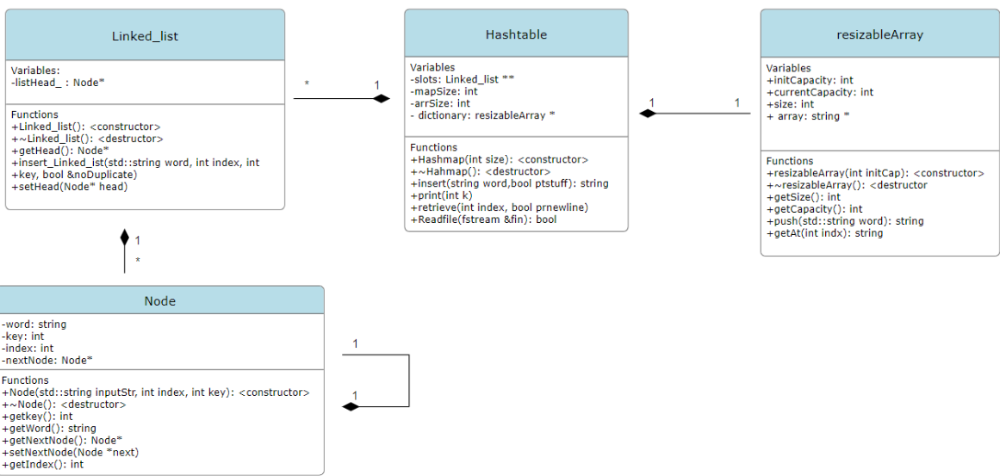

Rain Luo (r8luo)
October 16th, 2023

Project design decisions
For this project, I decided to have 4 classes: Hashmap, Linked_list, Node, resizableArray (adapted from Mike’s code from learn) class. In the Hashmap class, it contains all the functions that the driver code (interface.cpp) interacts with. 
The reason for not implementing a dictionary within my Hashmap class is to ensure clarity and organizability. 
I decided to use a linked list data structure inside the hashtable to ensure there will always be space for elements to be inserted. 
For the destructor, I decided to implement all the deletion in my Hashmap class. It would first deallocate each node of the linked list, then the linked list itself, then the hashtable. Aswell, it would deallocate the dictionary.
I have decided to combine commands to be called to the same function to ensure efficiency. RETRIEVE and TOKS invoke the function void hashmap::retrieve(int index, bool ptnewline). I use the boolean variable ptnewline to distinguish the commands from inside the function. If ptnewline is true, I would print the word followed by std::endl, if ptnewline is false I would simply output the word followed by space. This is also true for TOKENIZE and STOK. 

Runtime Analysis
Command :  RETRIEVE
This only requires us to return the index of the resizable array if the index is valid. Functions consist of purely conditional statements. Thus takes O(1).

Command :  TOKENIZE
With the assumption of uniform hashing, the amount of input per slot is proportional to the amount of slots. N = O(M). This is the load factor α = O(1). Inserting(and iterating through the array) would take O(1) time. 

Command :  INSERT
With the assumption of uniform hashing, the amount of input per slot is proportional to the amount of slots. N = O(M). This is the load factor α = O(1). Inserting(and iterating through the array) would take O(1) time on average. 

If the hashing is not uniform, or the hashtable only has one slot, the command INSERT would be O(N).

Overview of Classes:
Hashmap class:
Member functions 
public: 
    Hashmap( int size) : Constructor. Creates an instance of the Hashmap. Takes the parameter ‘size’ and initialize slot to be an array of size ‘size’ 
    ~Hashmap(): Destructor, first goes to individual slots of the array, traverses through the linked-list, deallocating each node, then deallocating the linked list
    std::string insert(std::string word): 
Performs validations on input to ensure containing of purely letters. Compute the hash value and key
Goes to the corresponding slots on the hashtable, attempts to insert the element. Checks to see if it already exists in the linked list(by calling insert function in linked-list), adds it to the dictionary and the linked list if it does not contain the word.
This is not a void function because I called this function with my bool Readfile(std::fstream &fin) function and it uses the return value (either ‘success’ or ‘failure’) to determine the return value of the bool Readfile(std::fstream &fin) function.
    void print(int k): Inteates through the linked list and prints out the key value.
    void tokenize(std::string word, bool ptnewline): check the world's existence by calculating the hash value and then search the element by  iterating the corresponding linked list. If found, return the index, otherwise return 0.
    void retrieve(int index, bool ptnewline): given the token, return the element stored in the resizable array class.
    bool Readfile(std::fstream &fin): Reading a file using std::fstream. Takes in each word one at a time and attempts to insert it into the hashmap if it does not already exist. If one or more words are inserted, the function will return true.

Member variables: 
private:
    Linked_list **slots: Array of pointers each pointing to an linked_list object 
    int mapSize:  size of the map 
    int arrSize: Used to initialize the initial size of the resizable array. 
    int index: Next available index to insert the word at 
    resizableArray *dictionary: Instance of the resizable array class. 

Node class:

This class only contains getters and setters for the private variable. 
The variables are private to ensure that they can only be returned, not modified. (with the exception of the nextNode)
For the setter, I only have one setting for the next element. As other member variables of the node do not need to be changed. 
Member functions:
Node(std::string inputStr, int index, int key): constructor, creates an instance of the node and sets all the private variables.
~Node(): Destructor. Empty because I chose to do everything in the Hashmap class.
int getkey(): return the summation of the ascii value of the word.
std::string getWord(): returns the word.
Node* getNextNode(): returns a pointer to the next node.
void setNextNode(Node *next): sets the pointer to the next node.
int getIndex(): Returns the index of the word on the resizable array.

Member variables:
std::string word;
int key;
int index;
Node *nextNode;

Linked_list class:

Member functions
Public: 
Linked_list(): constructor
~Linked_list(): Destrutor.
std::string insert_Linked_ist(std::string word, int index, int key, bool &noDuplicate): Iterate through the linked list and check for duplicates. I made a boolean variable that is passed in by reference. If noDuplicate is true, the word will be inserted into the dictionary by the Hashmap::inset(std::string word) class.
Void setHead (Node * head): Sets the head of the member variable.
Node* getHead(): Returns the head.

Member variables:
Private: 
Node* listhead_: Stores the first node of the linked list. Private because no function outside the class should interact with it.

Resiz	ableArray class: 
For this class. I made the design decision that the array index should start from 1 rather than 0 because of the structure of the token system. This code is an adaptation of Mike’s code posted on LEARN.

Citation: 
[1]  Mike Cooper-Stachowsky, “Tutorial #1 resizeArray.cpp” Canada 2023.

Member function 
Public: 
resizableArray(int initCap): Constructor.
~resizableArray(): Destructor.
int getSize(): returns the amount of index that is filled with words in the array.
int getCapacity(): returns the capacity of the array. 
void push(std::string word): Inserts the word onto the size+1 index of the array.
std::string getAt(int indx): returns the word at the index, if the index is less than the size. This is to ensure that I do only return valid words, not empty strings at the array indexes.

Member Variables 
int initCapacity: Initial capacity given by the program, used to initialize the original array through the constructor.
int currentCapacity: Current capacity. 
int size: the amount of index that is filled with words in the array.
std::string* array: Pointer to an array of string. Storing all the words.

