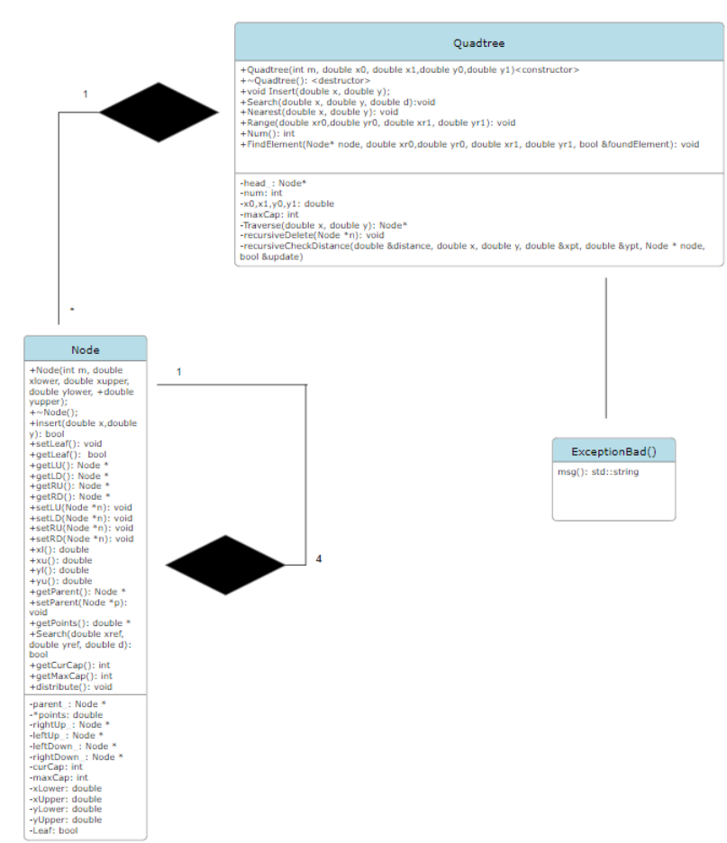

Rain Luo (r8luo)November 20th, 2023

Project design decisions
For this project I decided to have 3 classes: Quadtree, Node, ExceptionBad class. In the Quadtree class, it contains all the functions that the drive code (driver.cpp) interacts with.
The reason to not have a class for storing points is because since there are only 2 double data types stored per point, it can just be a part of the node class. 
For the destructor for the Quadtree class, I was inspired by a Stack Overflow post on destructor for BST. The algorithm recursively calls itself to delete all the nodes from BST. I adapted a similar approach in this project.

Runtime Analysis
Command: INSERT
My implementation of INSERT is done in the following fashion:
Insert command is detected, input parameter is taken in, Insert(double x, double y) function in Quadtree is called. O(1)
Insert(double x , double y) calls a private class Traverse(double x, double y), which goes to the leaf node that contains the coordinate (x,y). Traverse(double x, double y) travels the tree by looking at the bound each node contains with the x and y coordinate. Since Traverse(double x, and y) goes to one of the leaves of the tree, Traverse(double x, and y) takes O(D) time.
Once we arrive at the leaf node. We check if we need to split, this is done in O(1) time and we distribute the content in the former leaf to the 4 new leaves. The runtime of distribution is disregarded since it does not depend on the depth of the tree. We keep on splitting until we have reached a leaf that contains empath space to insert the point.
The point is inserted. O(1).

O(INSERT) =  O(step 1 +step 2 + step 3 + step 4) = O(D)

Command: RANGE 
My implementation of RANGE for the case where the search range falls entirely within the rectangle described by a single leaf node is done in the following fashion:

Range command is detected, input parameter is taken in. Range(double xr0, double yr0, double xr1, double yr1) function in Quadtree is called. O(1)
Recursively check if any of the 4 vertices falls within any sub quadrants bounded by each node. If so, we call the same function on the bounded node. We repeat this until we reach the leaf node. Since the search range falls entirely within the rectangle described by a single leaf node, this takes O(D) time.
Iterate through the node. Checks if points bounded by the node are contained by the range. The runtime of this is disregarded since it does not depend on the depth of the tree. 

O(RANGE) =  O(step 1 +step 2 + step 3) + step 4) = O(D)
Note: this no longer is the case if the bound fails to be contained by a single node. 

Overview of Classes:
Class: Quadtree

Public variables:

Quadtree(int m, double x0, double x1,double y0,double y1): Constructor for the project.
~Quadtree(): Destructor for the project. The idea for this destructor was inspired by a stack Overflow response on the destructor for binary search trees. [1]. The destructor calls a function(recursiveDelete()) that recursively deletes each node.

void Insert(double x, double y): Meant for the INSERT Keyword
Goes the leaf node that the (x,y) coordinate belong (using the Traverse() function))
Check for the node’s capacity. If it is full we split the node and distribute the coordinate stored to the newly created node. I wrote a loop that keeps splitting the node if it is full  until we have space for the new coordinate 
Iterate through the node’s internal array containing the coordinates to check for duplicates. If a duplicate is found, the function will return false.
If no duplicates are found we insert the coordinate and return true.

void Search(double x, double y, double d): Meant for the SEARCH Keyword
Goes the leaf node that the (x,y) coordinate belongs to (using the Traverse() function))
Check if x 土 d or y 土 d are contains within this node.
If not we keep traveling up the tree until we hit a node where x 土 d or y 土 d  is contained. 
Call Search() on that node and check for the return type. 
If return true, output “point exists”
If return false, output “no point exists”

	

void Nearest(double x, double y): Meant for the NEAREST Keyword

Check if the Quadtree have any points within, if no return “no point exists”
Goes to every leaf node by recursively going to the 4 children if the node is not leaf.
Once arrived at the leaf node, compute the distance between each coordinate stored with (x,y). (Initially, distance will be the max integer)
If distance is equal, check which x coordinate is higher, store the pair with the higher x value.
If the computed distance is less than the previous best distance, update the distance and store the x and y coordinate. 
Return the coordinate 

void Range(double xr0,double yr0, double xr1, double yr1): Meant for the RANGE Keyword

Computes the location of the 4 vertices. Also check for illegal arguments. 
If the node is not leaf, check which child each of the vertices falls into. Repeat this process until we reach the root 
Linearly iterates through the points of the root and checks if it falls on the boundary. If so, print it out. 

int Num():  Meant for the NUM Keyword (Done by FindElement()): During successful inserts a private variable (NUM) will be incremented. This returns the member variable
void FindElement(Node* node, double xr0,double yr0, double xr1, double yr1, bool &foundElement): called by Range() to recursive to to the root containing the vertices and check if the vertices of the child falls within the bound of the range contained by (xr0, yr0) and (xr1, yr1). Once we are at the node we iterate through the points of the root and check if it falls on the boundary. If so, print it out

Private variables :
Node* Traverse(double x, double y): Given x and y coordinate, go to the leaf containing x and y.
void recursiveDelete(Node *n): Recursively deleted the node. [1]
void recursiveCheckDistance(double &distance, double x, double y, double &xpt, double &ypt, Node * node, bool &update): Recursively checks distance of all coordinate with the provided coordinate. Used in Nearest.
int num: Integer that gets incremented everything during a successful insert.
double x0,x1,y0,y1: Bound of the quadtree.
Node * head_: root of the quadtree
int mapCap: maximum capacity of nodes inside the quadtree.

Class: Node

Public functions
Node(int m,  int xlower, double xupper, double ylower, double yupper): Constructor. Initialize a dynamically allocated array of size 2*m to store m coordinates. 
~Node(): Destructor. Deallocates the dynamically allocated array.
bool Search(double xref, double yref double d): Iterate through each coordinate and compute the distance between the reference coordinate and the coordinates within the array. Return true is the computed distance is less than the parameter passed in. 
Void distribute(): Called when the amount of coordinate reached m. Dynamically allocated 4 children and distribute the coordinate amongst the children.

Private functions & variables 
Node *parent_ : parent of the said node.
Double * points: coordinate of the points stored inside the node.
Node *rightUp_: The node right up (first quadrant).
Node *leftUp_: The node left up (second quadrant) .
Node *leftDown_: The node left down (third quadrant).
Node *rightDown_: The node right down (fourth quadrant).
int curCap: amount of coordinate currently in the point.
int maxCap: Maximum amount of coordinate that can be stored within a point. 
double xUpper, xLower, yUpper, yLower: area bounded by the node.
bool leaf: indicate that the node is a leaf element.

Class: ExceptionBad
This class is being called my main. The driver code will perform input validation and throw and catch exceptions.

Public function
std::string msg(): returns “illegal argument” if illegal inputs are detected. 

UML Diagram

Citation 

[1] Matthew S, “ Destructor for Binary Search Tree”, 2015
